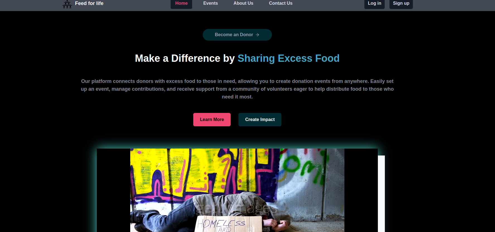
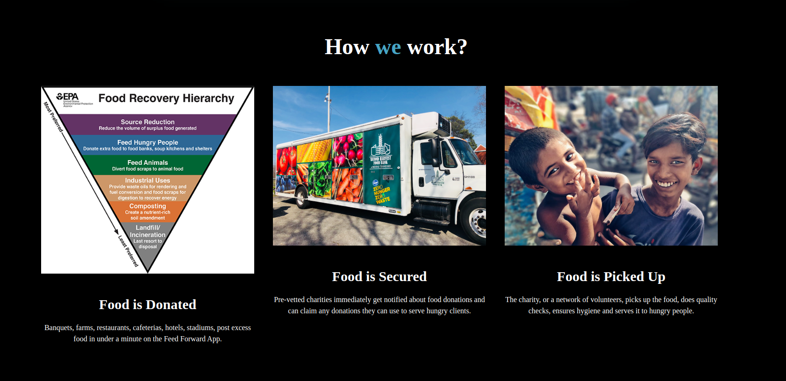
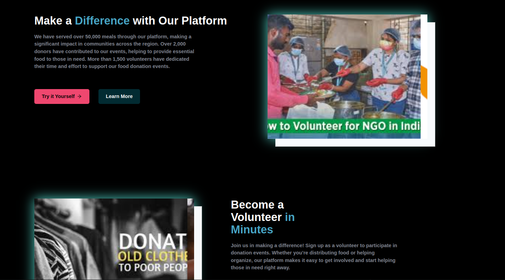
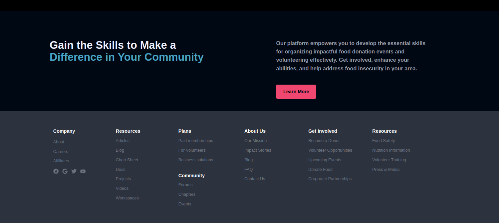
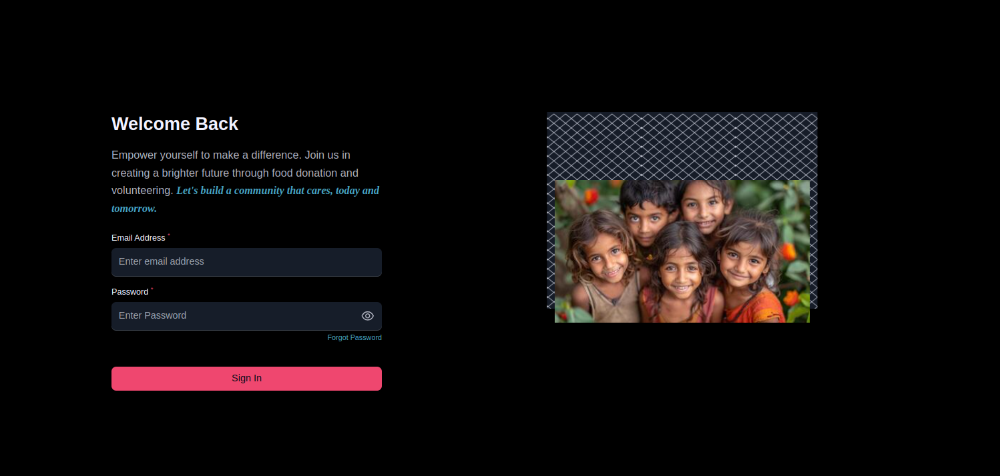
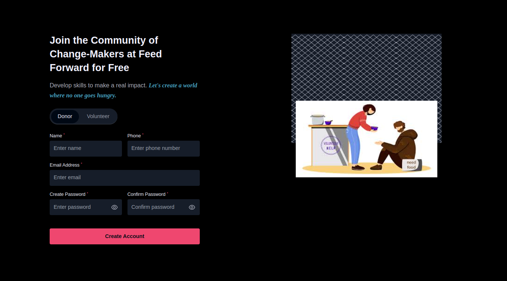
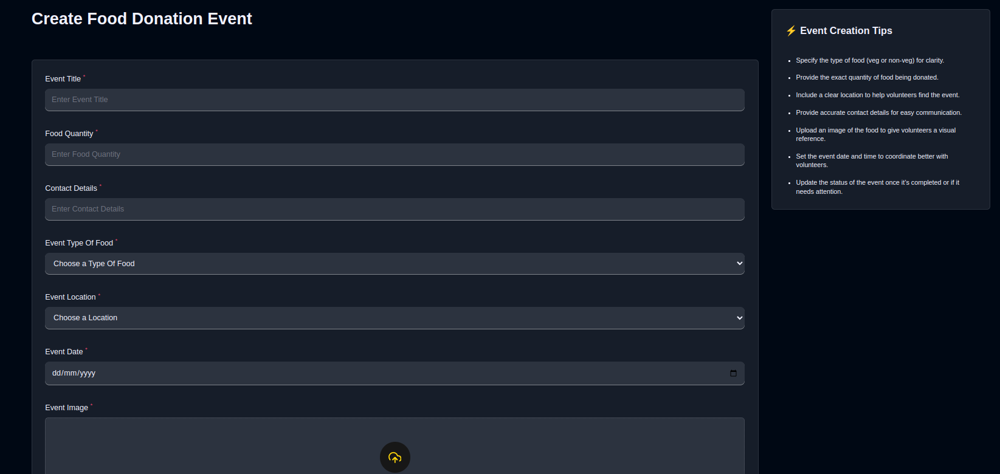
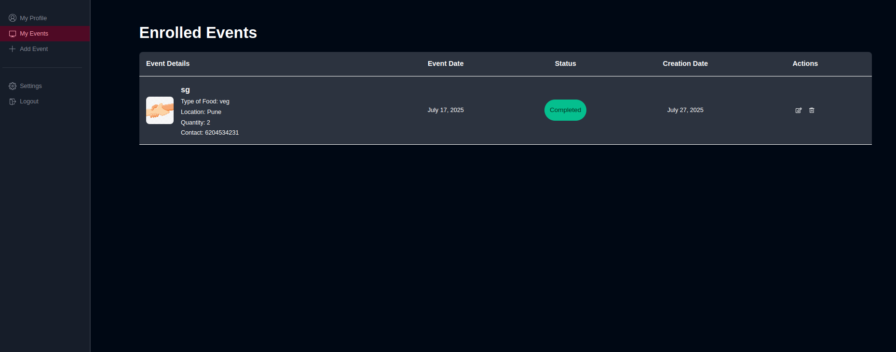
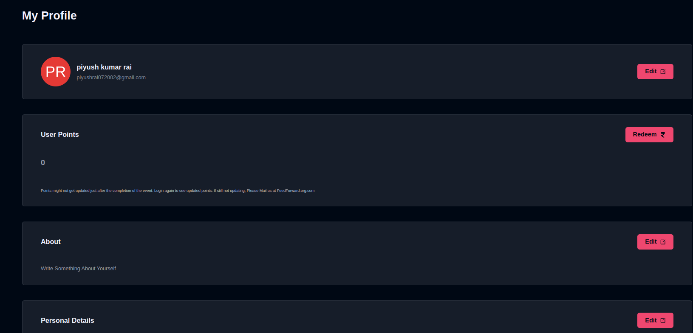
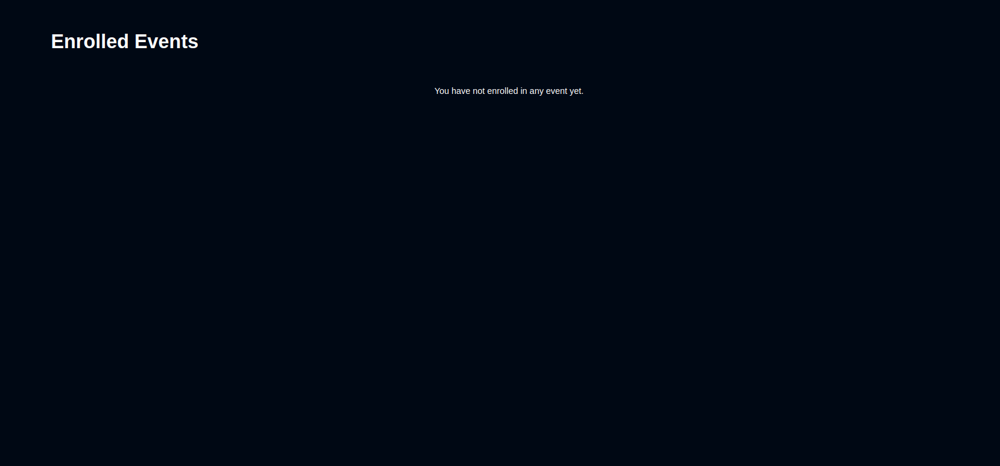

# Feed For Life  
**Live Demo:** [https://feed-forward-red.vercel.app/](https://feed-forward-red.vercel.app/)

## Screenshots

  
  
  
  
  
  
  
  
  
  

---

## About Feed For Life

Feed For Life is a web platform built to make food donation easier and more organized. It connects donors who want to share food with volunteers ready to help distribute it, contributing towards the United Nations Sustainable Development Goal #2: Zero Hunger.

The platform is created using the MERN stack (MongoDB, Express.js, React.js, Node.js) along with Tailwind CSS for styling. It uses React-Redux for managing app state and Cloudinary to handle image uploads.

---

## Main Features

- **User Roles**  
  - **Donors:** Can create, update, and delete food donation events. They also manage volunteer participation and can mark events as done.  
  - **Volunteers:** Can sign up or withdraw from events and see the list of events they’re part of.

- **User Profiles**  
  Users can edit their personal details and preferences easily.

- **Event Management**  
  Donors can add event details like event name, location, date, time, type of food, and upload event photos.

- **Points & Rewards**  
  Volunteers earn points for participating in events which can be redeemed later.

- **Mobile-Friendly**  
  The design works well on phones and tablets using a mobile-first approach with Tailwind CSS.

- **Accessibility**  
  The platform follows accessibility best practices to ensure everyone can use it comfortably.

## Technologies Used

- **Frontend:** React.js, Tailwind CSS, React-Redux
- **Backend:** Node.js, Express.js
- **Database:** MongoDB
- **Image Uploads:** Cloudinary
- **Authentication:** JSON Web Tokens (JWT)
- **Deployment:** Vercel (frontend), Render (backend)

## Getting Started

### Prerequisites

- Node.js
- npm or yarn
- MongoDB
- Cloudinary account

Thank you for using the Food Donation Event Platform and contributing to the fight against hunger!

# Feed-for-life   
